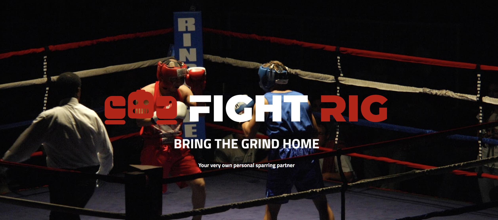

<!-- Improved compatibility of back to top link: See: https://github.com/othneildrew/Best-README-Template/pull/73 -->
<a name="readme-top"></a>
<!--
*** Thanks for checking out the Best-README-Template. If you have a suggestion
*** that would make this better, please fork the repo and create a pull request
*** or simply open an issue with the tag "enhancement".
*** Don't forget to give the project a star!
*** Thanks again! Now go create something AMAZING! :D
-->


<!-- PROJECT SHIELDS -->
<!--
*** I'm using markdown "reference style" links for readability.
*** Reference links are enclosed in brackets [ ] instead of parentheses ( ).
*** See the bottom of this document for the declaration of the reference variables
*** for contributors-url, forks-url, etc. This is an optional, concise syntax you may use.
*** https://www.markdownguide.org/basic-syntax/#reference-style-links
-->
[![Contributors][contributors-shield]][contributors-url]
[![Forks][forks-shield]][forks-url]
[![Stargazers][stars-shield]][stars-url]
[![Issues][issues-shield]][issues-url]
[![MIT License][license-shield]][license-url]


<!-- PROJECT LOGO -->
<br />
<div align="center">
  <a href="https://github.com/FightRig/FightRig">
    
  </a>

<h3 align="center">Fight Rig</h3>

  <p align="center">
    A at-home boxing solution that hits back, and evades punches.
    <br /> 
    <a href="https://github.com/FightRig/FightRig"><strong>Explore the docs »</strong></a>
    <br />
    <br />
    <a href="https://github.com/FightRig/FightRig">View Demo</a>
    ·
    <a href="https://github.com/FightRig/FightRig/issues">Report Bug</a>
    ·
    <a href="https://github.com/FightRig/FightRig/issues">Request Feature</a>
  </p>
</div>


<!-- TABLE OF CONTENTS -->
<details>
  <summary>Table of Contents</summary>
  <ol>
    <li>
      <a href="#about-the-project">About The Project</a>
      <ul>
        <li><a href="#built-with">Built With</a></li>
      </ul>
    </li>
    <li>
      <a href="#getting-started">Getting Started</a>
      <ul>
        <li><a href="#prerequisites">Prerequisites</a></li>
        <li><a href="#installation">Installation</a></li>
      </ul>
    </li>
    <li><a href="#usage">Usage</a></li>
    <li><a href="#roadmap">Roadmap</a></li>
    <li><a href="#contributing">Contributing</a></li>
    <li><a href="#license">License</a></li>
    <li><a href="#contact">Contact</a></li>
    <li><a href="#acknowledgments">Acknowledgments</a></li>
  </ol>
</details>


<!-- ABOUT THE PROJECT -->
## About The Project

[![Product Name Screen Shot][product-screenshot]](https://sites.google.com/icsd.k12.ny.us/impact-combat-sports?usp=sharing)

Of our 25 people interviewed in the combat sports sector, more than 80% of the people who train stated that they struggled with getting in regular practice. The main problems they faced were finding the time and money to go to a gym, and training sparring skills at home. Even if they do go to a gym, our interviewees noted how challenging it was to find a sparring partner of similar skill, weight, and converging availability. Develop a marketable product allowing users to train in boxing, kickboxing, and MMA at home or a gym without needing a partner, specifically targeting the skills, techniques, and abilities that would otherwise need another person.


<p align="right">(<a href="#readme-top">back to top</a>)</p>


### Built With

* [![Python Badge][python]][python-url]
* [![Raspberry Pi Badge][rpi]][rpi-url]

<p align="right">(<a href="#readme-top">back to top</a>)</p>

### Prerequisites

Create a virtual environment with 
* ```sh
  python3 -m venv venv
  ```
Activate the environment
* ```sh
  .\venv\Scripts\activate
  ```

Or, if you're using Linux:
* ```sh
  source venv/bin/activate
  ```


These prerequisites should already be preinstalled on the raspberry pi.
* ```sh
  pip3 install pygame
  ```

Now install ultralytics and torch
* ```sh
  pip3 install ultralytics
  ```

* ```sh
  pip3 install torch torchaudio torchvision --index-url https://download.pytorch.org/whl/cu121
  ```

Now, if you `pip freeze`
it should show
```
torch==2.2.1+cu121
torchaudio==2.2.1
torchvision==0.17.1+cu121
```

### Installation and Usage


1. Clone the repo
```sh
git clone https://github.com/FightRig/FightRig.git
```

2. Ensure you have the correct wiring. The wiring diagram looks like this. (You can power the pi with a battery pack). MAKE SURE TO REMOVE THE 5V enable jumper. WE ARE POWERING THIS WITH 24V, so take this out first.

3. SSH into the raspberry pi with 
```sh
ssh pi@octane
``` 
  The password is `geneavianina`
4. CD into the project directory
```sh
cd FightRig
```
5. run `python pose.py` to run the vision, run `python joy.py` to run the joystick.
<p align="right">(<a href="#readme-top">back to top</a>)</p>


<!-- ROADMAP -->
## Roadmap
- [X] Empathy Fieldwork
- [X] Model
- [X] CAD + Designs
- [ ] Printing/purchasing parts
- [ ] Fabricating
- [ ] Raspberry PI wiring
- [ ] Programming subsystems
    - [ ] Rewriting the code such that it follows a nice project structure that would make Mr. Deppe proud.
- [ ] Testing

See the [open issues](https://github.com/FightRig/FightRig/issues) for a full list of proposed features (and known issues).

<p align="right">(<a href="#readme-top">back to top</a>)</p>


<!-- CONTRIBUTING -->
## Contributing

Contributions are what make the open source community such an amazing place to learn, inspire, and create. Any contributions you make are **greatly appreciated**.

If you have a suggestion that would make this better, please fork the repo and create a pull request. You can also simply open an issue with the tag "enhancement".
Don't forget to give the project a star! Thanks again!

1. Fork the Project
2. Create your Feature Branch (`git checkout -b feature/AmazingFeature`)
3. Commit your Changes (`git commit -m 'Add some AmazingFeature'`)
4. Push to the Branch (`git push origin feature/AmazingFeature`)
5. Open a Pull Request

<p align="right">(<a href="#readme-top">back to top</a>)</p>


<!-- LICENSE -->
## License

Distributed under the MIT License. See `LICENSE.txt` for more information.

<p align="right">(<a href="#readme-top">back to top</a>)</p>


<!-- CONTACT -->
## Contact

Geneustace Wicaksono - [My Website](https://genewica.herokuapp.com) - geneustacewicaksono@yahoo.com

Project Link: [https://github.com/FightRig/FightRig](https://github.com/FightRig/FightRig)

<p align="right">(<a href="#readme-top">back to top</a>)</p>


<!-- ACKNOWLEDGMENTS -->
## Acknowledgments

* [Lucas West]()
* [Matthew Simpkins Marston]()
* [Nicholas Schill]()

<p align="right">(<a href="#readme-top">back to top</a>)</p>


<!-- MARKDOWN LINKS & IMAGES -->
<!-- https://www.markdownguide.org/basic-syntax/#reference-style-links -->
[contributors-shield]: https://img.shields.io/github/contributors/Sentientplatypus/octane7.svg?style=for-the-badge
[contributors-url]: https://github.com/FightRig/FightRig/graphs/contributors
[forks-shield]: https://img.shields.io/github/forks/Sentientplatypus/octane7.svg?style=for-the-badge
[forks-url]: https://github.com/FightRig/FightRig/network/members
[stars-shield]: https://img.shields.io/github/stars/Sentientplatypus/octane7.svg?style=for-the-badge
[stars-url]: https://github.com/FightRig/FightRig/stargazers
[issues-shield]: https://img.shields.io/github/issues/Sentientplatypus/octane7.svg?style=for-the-badge
[issues-url]: https://github.com/FightRig/FightRig/issues
[license-shield]: https://img.shields.io/github/license/Sentientplatypus/octane7.svg?style=for-the-badge
[license-url]: https://github.com/FightRig/FightRig/blob/master/LICENSE.txt
[linkedin-shield]: https://img.shields.io/badge/-LinkedIn-black.svg?style=for-the-badge&logo=linkedin&colorB=555
[linkedin-url]: https://linkedin.com/in/linkedin_username
[product-screenshot]: images/rig.png
[jumper]: images/jumper.png
[body]: images/body.png
[python]: https://img.shields.io/badge/Python-3776AB?style=for-the-badge&logo=python&logoColor=white
[python-url]: https://python.com
[rpi]: https://img.shields.io/badge/Raspberry%20Pi-A22846?style=for-the-badge&logo=Raspberry%20Pi&logoColor=white
[rpi-url]: https://raspberrypi.com
